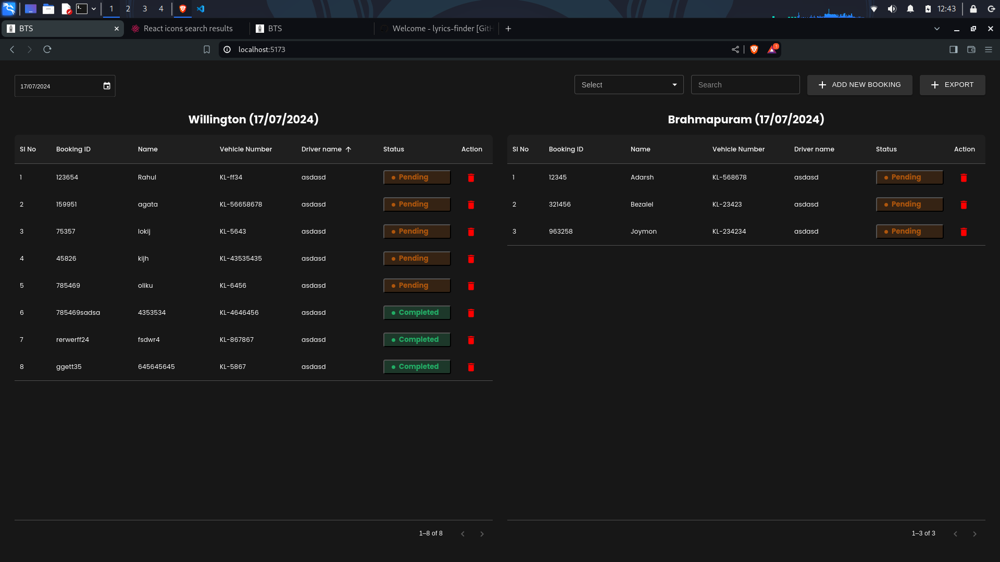
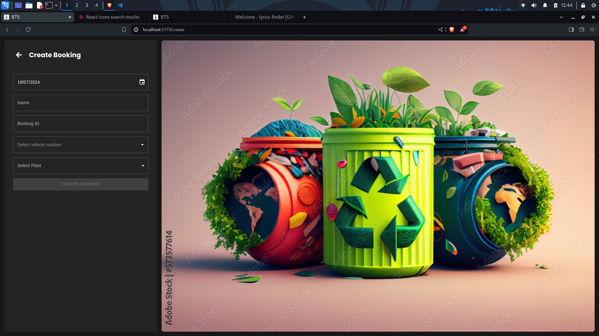

# BOOKING TRACKING SYSTEM (BTS) Backend

## Features

- View the list of booking in a particular date
- Filter the list based on various selectors
- Delete booking
- Change booking status
- Create booking
- Booking id should be unique
- Each vehicle can have only one booking per day unless created forcefully
- Add comment for each booking

## Built with

- Python 3
- Django
- PyMongo
- MongoDB

## Design

